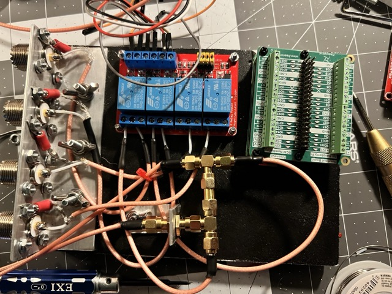
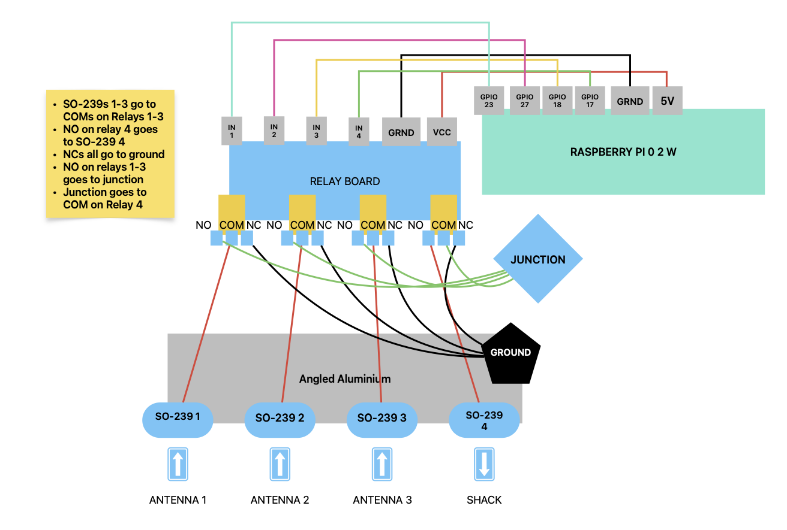

# WY6Y CyberPunk HF Antenna Switch

Raspberry Pi Zero 2 W-based 3-antenna switch for HF (100W), controlled via Flask. Uses ANMBEST 4-channel relay (active HIGH), Freenove Breakout Board HAT, and SO-239s in a DXE-UE-2P box with Alpha Delta arrestor.

## License
This project is licensed under the Creative Commons Attribution-NonCommercial 4.0 International License—see `LICENSE` for details. You must credit Stephen Houser WY6Y and link to https://creativecommons.org/licenses/by-nc/4.0/ when using or sharing this work.

## Files
- `switch_antenna.py`: Controls relays (GPIO 23, 27, 18 for antennas; 17 for Shack).
- `web.py`: Flask app (inline HTML, port 5002).
- `static/cyberpunk-bg.jpg`: UI background.
- `antenna_switch.service`: Systemd service.

## Hardware
- Raspberry Pi Zero 2 W (pre-soldered).
- Freenove Breakout Board HAT.
- ANMBEST 4-channel relay (active HIGH).
- 4x SO-239s—wired to relay (COM, NO1-NO3).
- 5” x 9” PVC board—fits DXE-UE-2P (9.5” x 5.5” x 3.5”).
- Bias-T (5V) or USB power.
- Alpha Delta arrestor.
- Angled Aluminium
- RG 316 Coax
- 

## Setup
1. Install Raspberry Pi OS, enable SSH (port 2222).
2. Copy files to `/home/[user]/antenna_switch`.
3. Install: `sudo apt install python3-flask python3-rpi.gpio python3-flask-session`.
4. Copy `antenna_switch.service` to `/etc/systemd/system/`, enable: `sudo systemctl enable antenna_switch.service`.
5. Wire HAT to relay: 5V, GND, GPIO 23 (IN1), 27 (IN2), 18 (IN3), 17 (IN4).
6. Test: `./switch_antenna.py 1`, `http://[IP]:5002`.

## Wiring
The ANMBEST 4-channel relay connects antennas to the Shack coax:
- SO-239s 1-3 to COM1-3 (Doublet, Emcomm III-B, Aux).
- NO1-3 to junction, junction to COM4.
- NO4 to SO-239 4 (Shack).
- NC1-4 to DXE-UE-2P SPG bus (ground).

[Download PDF](docs/WY6Y_Switch_Diagram.pdf)

### Detailed Setup
- **SSH:** Enable via `raspi-config` or add `ssh` file to SD card boot.
- **GPIO:** Ensure RPi.GPIO installed—`sudo pip3 install RPi.GPIO`.
- **Firewall:** Allow port 5002—`sudo ufw allow 5002`.

## Troubleshooting
- **No Relay Clicks:** Check wiring (5V, GND, GPIO 23, 27, 18, 17). Verify ANMBEST relay is active HIGH.
- **Flask Fails:** Ensure `python3-flask-session`—`sudo apt install python3-flask-session`.
- **Port Blocked:** Run `sudo netstat -tuln | grep 5002`—kill conflicts.

## Notes
- Relay NC to SPG bus—Alpha Delta backs up.
- 100W HF—don’t exceed 200W.
- Customize `app.secret_key`, username, password in `web.py`.

## Demo Video
Watch the WY6YPi Antenna Switch in action: [YouTube Video](https://youtu.be/Wce_CUvI8qY)
